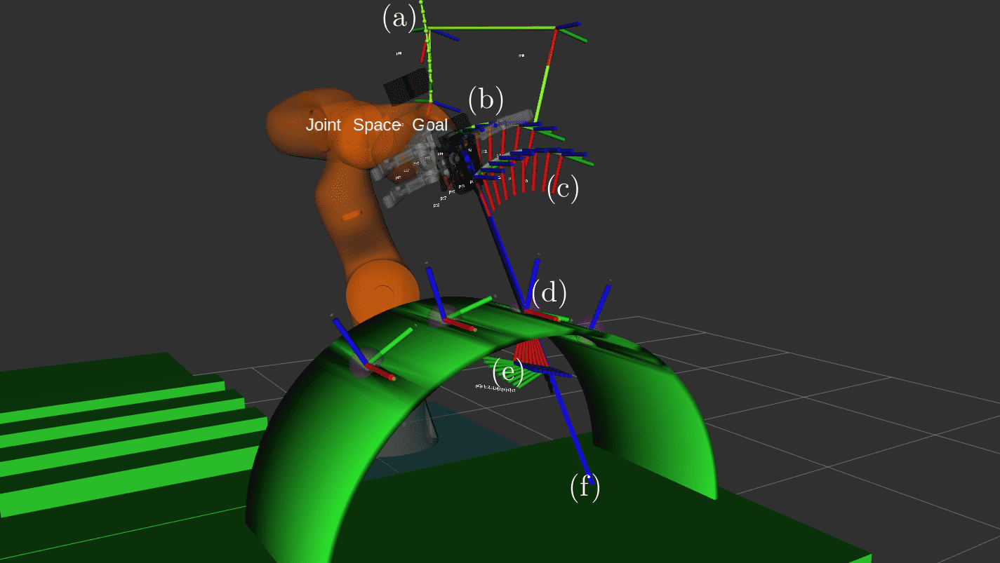

Surgery Robotics with KUKA LBR iiwa and Barrett
================================================

See full documentation at [https://karadalex.github.io/surgery_robotics_kuka_barrett/](https://karadalex.github.io/surgery_robotics_kuka_barrett/)



## Documentation

Documentation was written using Sphinx and the Read-the-Docs theme. To build documnetation run 
```
cd docs_src
make github
```
or instead of `make github` run `make html` or `make latexpdf`